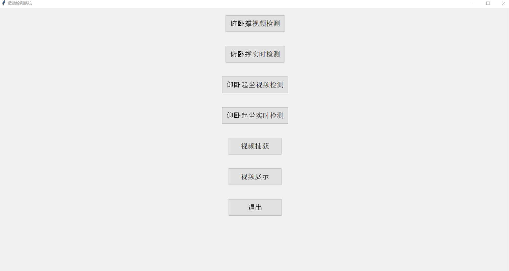
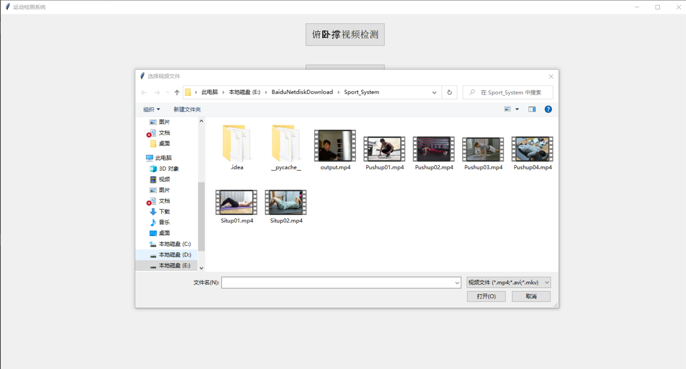
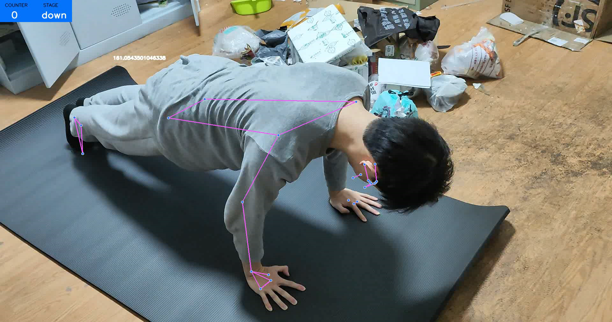

# Sit_ups-Push_ups-Counting
# 运动检测系统

本系统主要针对俯卧撑和仰卧起坐两种运动，提供视频检测（离线检测）与实时检测等功能，并能够进行视频捕获与视频展示，满足用户对运动数量统计与状态监控的需求。

---

## 界面截图示例

> 以下示例图片仅用于展示界面效果，实际使用时可根据需求替换为真实图片或截图路径。

---

## 1. 俯卧撑和仰卧起坐视频检测

1. **提供按钮**  
   - 「俯卧撑视频检测」  
   - 「仰卧起坐视频检测」

2. **视频文件选择**  
   - 当用户点击上述按钮后，会弹出文件对话框。  
   - 用户可在对话框中选择本地的视频文件（如 `.mp4`, `.avi`, `.mkv` 等）。

3. **调用检测脚本**  
   - 当用户完成视频选择后，程序会调用相应的运动检测脚本，分析所选视频中俯卧撑或仰卧起坐的动作。  
   - 最终在界面上显示检测到的动作数量。

---

## 2. 俯卧撑和仰卧起坐的实时检测

1. **摄像头实时读取**  
   - 通过摄像头实时捕获视频流，将图像数据传入树莓派或 PC 端进行处理。  

2. **实时处理与显示**  
   - 系统会对实时视频中的人体关键点进行检测与分析。  
   - 显示器会在界面上实时更新当前运动状态（如：down/up）以及完成的个数计数。

---

## 3. 视频捕获和视频展示

1. **视频捕获**  
   - 提供按钮「视频捕获」。  
   - 点击后，程序会启动摄像头进行实时视频捕获，可以保存或直接用于检测。

2. **视频展示**  
   - 提供按钮「视频展示」。  
   - 点击后，弹出文件选择对话框，用户可选择要展示的视频文件。  
   - 系统会在显示器界面上进行视频播放，以便用户回放和查看。

---

## 4. 系统硬件

1. **树莓派**  
   - 使用树莓派 4B（或性能更好的 PC 电脑）来进行视频数据的采集和处理。  

2. **摄像头模块**  
   - 一个兼容树莓派的摄像头模块，用于捕捉视频数据。  
   - 也可使用 USB 摄像头，具体根据实际需要进行适配。

3. **显示器**  
   - 连接树莓派或 PC 的显示器，用于展示图形用户界面、视频播放及检测结果。

---

## 5. 任务描述

- **系统框架设计**  
  共同负责整个系统的框架设计，明确了各个模块之间的协同工作，搭建了一个可扩展、易维护的整体架构。

- **界面设计与实现**  
  设计并实现了用户友好的图形用户界面，使用户能够轻松使用检测、实时监测、视频捕获和视频展示等功能。

- **硬件组装与调试**  
  完成了树莓派、摄像头、显示器等硬件设备的组装与调试，确保系统能够正常工作并与软件功能配合良好。

---

## 6. 完成情况

1. **模块化架构**  
   - 各功能模块（俯卧撑检测、仰卧起坐检测、视频捕获、实时检测等）均可独立运行，并易于扩展。

2. **用户体验**  
   - 界面采用直观布局与操作方式，并提供清晰的提示，用户能快速上手使用。  

3. **视频检测流程示例**  
   - 当用户点击「俯卧撑视频检测」按钮时，系统会弹出文件选择对话框；  
   - 用户选择视频后，程序调用俯卧撑检测脚本对动作进行识别和统计；  
   - 界面显示最终检测到的俯卧撑计数，并可重复或关闭检测流程。

---

以上即为系统整体介绍与功能说明。
